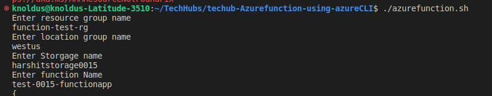
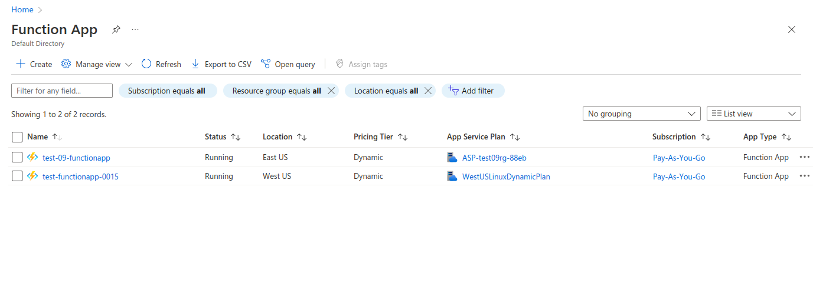

# Short Description about this template
This shell script helps to create azure function app.

# Steps for Execution 
1. Go to the terminal
2. Login in the azure account through CLI `az login`
3. `chmod a+x azurefunction.sh`
4. `./azurefunction.sh`

After run the script it take value at runtime for creating functionapp.

In the below image you can see the functionapp is created.

